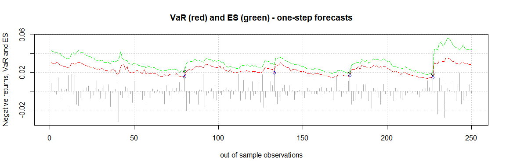
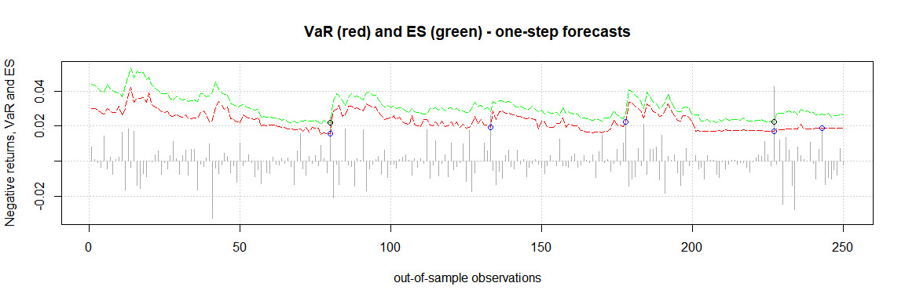

<!-- README.md is generated from README.Rmd. Please edit that file -->

# quarks

<!-- badges: start -->

[](https://CRAN.R-project.org/package=quarks)
[](https://lifecycle.r-lib.org/articles/stages.html#stable)
<!-- badges: end -->

The goal of `quarks` is to enable the user to compute Value at Risk
(VaR) and Expected Shortfall (ES) by means of various types of
historical simulation. Currently plain historical simulation as well as
age-, volatility-weighted- and filtered historical simulation are
implemented in `quarks`. Volatility weighting can be carried out via an
exponentially weighted moving average (EWMA) model or other GARCH-type
models.

## Installation

You can install the released version of quarks from
[CRAN](https://CRAN.R-project.org) with:

``` r
install.packages("quarks")
```

## Examples

The data set `DAX`, which is implemented in the `quarks` package,
contains daily financial data of the German stock index DAX from January
2000 to December 2021 (currency in EUR). In the following examples of
the (out-of-sample) one-step forecasts of the 97.5%-VaR (red line) and
the corresponding ES (green line) are illustrated. Exceedances are
indicated by the colored circles.

``` r
# Calculating the returns
prices <- DAX$price.close
returns <- diff(log(prices))
```

**Example 1 - plain historical simulation**

``` r
results1 <- rollcast(x = returns, p = 0.975, method = 'plain', nout = 250,
                     nwin = 250)
results1
#> --------------------------------------------
#> |              Specifications              |
#> --------------------------------------------
#>  Out-of-sample size:    250
#>  Rolling window size:   250
#>  Bootstrap sample size: N/A
#>  Confidence level:      97.5 %
#>  Method:                Plain
#>  Model:                 EWMA
#> --------------------------------------------
#> |           Forecast performance           |
#> --------------------------------------------
#>  Out-of-sample losses exceeding VaR
#>  
#>  Number of breaches:    4
#> --------------------------------------------
#>  Out-of-sample losses exceeding ES
#>  
#>  Number of breaches:    1
#> --------------------------------------------
```

Visualize your results with the plot method implemented in `quarks`.

``` r
plot(results1)
```


**Example 2 - age weighted historical simulation**

``` r
results2 <- rollcast(x = returns, p = 0.975, method = 'age', nout = 250,
                     nwin = 250)
results2
#> --------------------------------------------
#> |              Specifications              |
#> --------------------------------------------
#>  Out-of-sample size:    250
#>  Rolling window size:   250
#>  Bootstrap sample size: N/A
#>  Confidence level:      97.5 %
#>  Method:                Age Weighting
#>  Model:                 EWMA
#> --------------------------------------------
#> |           Forecast performance           |
#> --------------------------------------------
#>  Out-of-sample losses exceeding VaR
#>  
#>  Number of breaches:    5
#> --------------------------------------------
#>  Out-of-sample losses exceeding ES
#>  
#>  Number of breaches:    4
#> --------------------------------------------
```

``` r
plot(results2)
```


**Example 3 - volatility weighted historical simulation - EWMA**

``` r
results3 <- rollcast(x = returns, p = 0.975, model = 'EWMA',
                     method = 'vwhs', nout = 250, nwin = 250)
results3
#> --------------------------------------------
#> |              Specifications              |
#> --------------------------------------------
#>  Out-of-sample size:    250
#>  Rolling window size:   250
#>  Bootstrap sample size: N/A
#>  Confidence level:      97.5 %
#>  Method:                Volatility Weighting
#>  Model:                 EWMA
#> --------------------------------------------
#> |           Forecast performance           |
#> --------------------------------------------
#>  Out-of-sample losses exceeding VaR
#>  
#>  Number of breaches:    4
#> --------------------------------------------
#>  Out-of-sample losses exceeding ES
#>  
#>  Number of breaches:    3
#> --------------------------------------------
```

``` r
plot(results3)
```


**Example 4 - volatility weighted historical simulation - GARCH**

``` r
results4 <- rollcast(x = returns, p = 0.975, model = 'GARCH',
                     method = 'vwhs', nout = 250, nwin = 250)
results4
#> --------------------------------------------
#> |              Specifications              |
#> --------------------------------------------
#>  Out-of-sample size:    250
#>  Rolling window size:   250
#>  Bootstrap sample size: N/A
#>  Confidence level:      97.5 %
#>  Method:                Volatility Weighting
#>  Model:                 sGARCH
#> --------------------------------------------
#> |           Forecast performance           |
#> --------------------------------------------
#>  Out-of-sample losses exceeding VaR
#>  
#>  Number of breaches:    5
#> --------------------------------------------
#>  Out-of-sample losses exceeding ES
#>  
#>  Number of breaches:    3
#> --------------------------------------------
```

``` r
plot(results4)
```


**Example 5 - filtered historical simulation - EWMA**

``` r
set.seed(12345)
results5 <- rollcast(x = returns, p = 0.975, model = 'EWMA',
                     method = 'fhs', nout = 250, nwin = 250, nboot = 10000)
results5
#> --------------------------------------------
#> |              Specifications              |
#> --------------------------------------------
#>  Out-of-sample size:    250
#>  Rolling window size:   250
#>  Bootstrap sample size: 10000
#>  Confidence level:      97.5 %
#>  Method:                Filtered
#>  Model:                 EWMA
#> --------------------------------------------
#> |           Forecast performance           |
#> --------------------------------------------
#>  Out-of-sample losses exceeding VaR
#>  
#>  Number of breaches:    4
#> --------------------------------------------
#>  Out-of-sample losses exceeding ES
#>  
#>  Number of breaches:    3
#> --------------------------------------------
```

``` r
plot(results5)
```



**Example 6 - filtered historical simulation - GARCH**

``` r
set.seed(12345)
results6 <- rollcast(x = returns, p = 0.975, model = 'GARCH',
                     method = 'fhs', nout = 250, nwin = 250, nboot = 10000)
results6
#> --------------------------------------------
#> |              Specifications              |
#> --------------------------------------------
#>  Out-of-sample size:    250
#>  Rolling window size:   250
#>  Bootstrap sample size: 10000
#>  Confidence level:      97.5 %
#>  Method:                Filtered
#>  Model:                 sGARCH
#> --------------------------------------------
#> |           Forecast performance           |
#> --------------------------------------------
#>  Out-of-sample losses exceeding VaR
#>  
#>  Number of breaches:    5
#> --------------------------------------------
#>  Out-of-sample losses exceeding ES
#>  
#>  Number of breaches:    2
#> --------------------------------------------
```

``` r
plot(results6)
```



To further analyze these results one might apply backtesting to assess
the performance of these methods.

## Functions

In `quarks` five functions are available.

**Functions - version 1.0.11:**

-   `ewma`: Estimates volatility of a return series by means of an
    exponentially weighted moving average
-   `fhs`: Calculates univariate Value at Risk and Expected Shortfall by
    means of filtered historical simulation
-   `hs`: Computes Value at Risk and Expected Shortfall by means of
    plain and age-weighted historical simulation.
-   `rollcast`: Computes rolling one-step-ahead forecasts of Value at
    Risk and Expected Shortfall
-   `vwhs`: Calculates univariate Value at Risk and Expected Shortfall
    by means of volatility weighted historical simulation

For further information on each of the functions, we refer the user to
the manual or the package documentation.

**Data Sets**

-   `DAX`: Daily financial time series data of the German Stock Market
    Index (DAX) from January 2000 to December 2021
-   `DJI`: Daily financial time series data of the Dow Jones Industrial
    Average (DJI) from January 2000 to December 2021
-   `FTSE100`: Daily financial time series data of the Financial Times
    Stock Exchange Index (FTSE) from January 2000 to December 2021
-   `HSI`: Daily financial time series data of the Hang Seng Index (HSI)
    from January 2000 to December 2021
-   `NIK225`: Daily financial time series data of the Nikkei Heikin
    Kabuka Index (NIK) from January 2000 to December 2021
-   `SP500`: Daily financial time series data of Standard and Poor\`s
    (SP500) from January 2000 to December 2021
