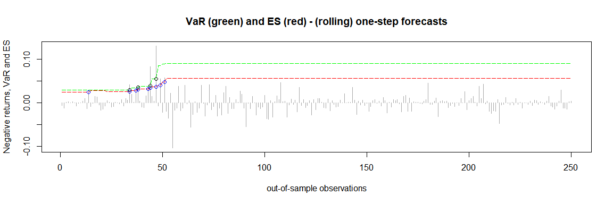
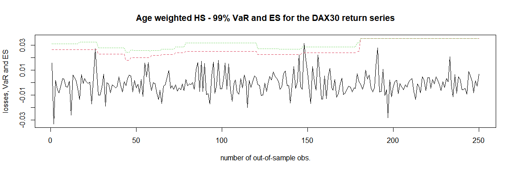

<!-- README.md is generated from README.Rmd. Please edit that file -->

# quarks

<!-- badges: start -->
<!-- badges: end -->

The goal of `quarks` is to enable the user to compute Value at Risk
(VaR) and Expected Shortfall (ES) by means of various types of
historical simulation. Currently plain historical simulation as well as
age and volatility-weighted historical simulation is implemented in
`quarks`. Volatility weighting is carried out via an exponentially
weighted moving average (EWMA). In future versions of `quarks`
volatility filtering by means of GARCH-type models will be considered.

## Installation

You can install the released version of quarks from
[CRAN](https://CRAN.R-project.org) with:

``` r
install.packages("quarks")
```

## Example 1

This is a basic example which shows you how to solve a common problem.
The data `DAX30` in this package contains daily financial data of the
DAX from 2000 to December 2019 (currency in EUR). In the following
examples the (out-of-sample) one-step forecasts of the 99%-VaR (red
line) and the corresponding ES (green line) are computed. Exceedances
are indicated by the colored circles.

``` r
library(quarks)         # Call the package
```

``` r
# Calculating the returns
prices <- DAX30$price.close
returns <- diff(log(prices))

### Example 1 - plain historical simulation 
results1 <- rollcast(x = returns, p = 0.99, method = 'plain', nout = 250,
                     nwin = 500)
plot(results1)
```



``` r
### Example 2 - age weighted historical simulation 
results2 <- rollcast(x = returns, p = 0.99, method = 'age', nout = 250,
                     nwin = 500)
plot(results2)
```



``` r
### Example 3 - volatility weighted historical simulation 
results3 <- rollcast(x = returns, p = 0.99, method = 'vwhs', nout = 250,
                     nwin = 500)
plot(results3)
```


To further analyze these results one might apply e.g. the traffic light
test to assess the performance of these methods.
