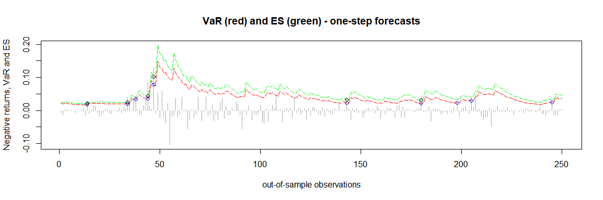
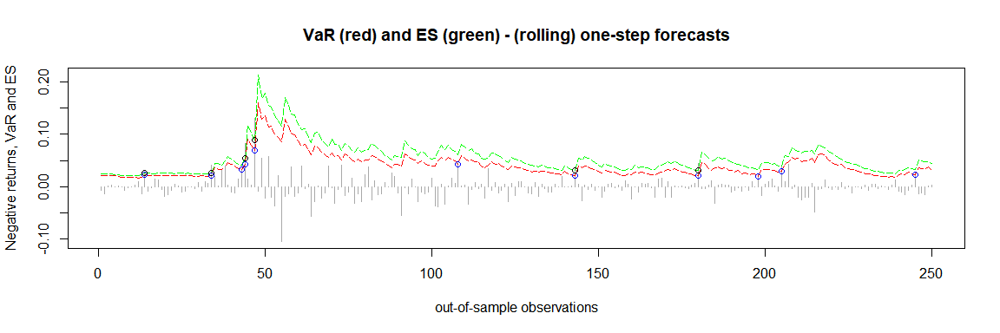

<!-- README.md is generated from README.Rmd. Please edit that file -->

# quarks

<!-- badges: start -->
<!-- badges: end -->

The goal of `quarks` is to enable the user to compute Value at Risk
(VaR) and Expected Shortfall (ES) by means of various types of
historical simulation. Currently plain historical simulation as well as
age-, volatility-weighted- and filtered historical simulation are
implemented in `quarks`. Volatility weighting can be carried out via an
exponentially weighted moving average (EWMA) model or other GARCH-type
models.

## Installation

You can install the released version of quarks from
[CRAN](https://CRAN.R-project.org) with:

``` r
install.packages("quarks")
```

## Examples

The data set `DAX30`, which is implemented in the `quarks` package,
contains daily financial data of the German stock index DAX from January
2000 to December 2020 (currency in EUR). In the following examples of
the (out-of-sample) one-step forecasts of the 97.5%-VaR (red line) and
the corresponding ES (green line) are illustrated. Exceedances are
indicated by the colored circles.

``` r
library(quarks)         # Call the package
```

``` r
# Calculating the returns
prices <- DAX30$price.close
returns <- diff(log(prices))

### Example 1 - plain historical simulation 
results1 <- rollcast(x = returns, p = 0.975, method = 'plain', nout = 250,
                     nwin = 500)
plot(results1)
```


``` r
### Example 2 - age weighted historical simulation 
results2 <- rollcast(x = returns, p = 0.975, method = 'age', nout = 250,
                     nwin = 500)
plot(results2)
```


``` r
### Example 3 - volatility weighted historical simulation - EWMA
results3 <- rollcast(x = returns, p = 0.975, model = 'EWMA',
                     method = 'vwhs', nout = 250, nwin = 500)
plot(results3)
```


``` r
### Example 4 - volatility weighted historical simulation - GARCH
results4 <- rollcast(x = returns, p = 0.975, model = 'GARCH',
                     method = 'vwhs', nout = 250, nwin = 500)
plot(results4)
```



``` r
### Example 5 - filtered historical simulation - EWMA
results5 <- rollcast(x = returns, p = 0.975, model = 'EWMA',
                     method = 'fhs', nout = 250, nwin = 500, nboot = 10000)
plot(results5)
```


``` r
### Example 6 - filtered historical simulation - GARCH
results6 <- rollcast(x = returns, p = 0.975, model = 'GARCH',
                     method = 'fhs', nout = 250, nwin = 500, nboot = 10000)
plot(results6)
```



To further analyze these results one might apply e.g. the traffic light
test to assess the performance of these methods.
